# Pump Monitoring System

A modern, containerized solution for real-time monitoring of industrial centrifugal pumps. This system transforms raw operational data into actionable insights through a sophisticated architecture combining data collection, storage, analysis, and visualization capabilities.

## Overview

The Pump Monitoring System provides comprehensive monitoring and analysis of centrifugal pump performance through a microservices architecture deployed on Kubernetes. It generates and processes real-time operational data, storing it efficiently in a time-series database while providing powerful visualization and alerting capabilities.

### Key Features

The system offers a range of capabilities designed to enhance pump monitoring and maintenance:

- Real-time data collection and analysis
- Automatic scaling based on monitoring demands
- Comprehensive visualization through Grafana dashboards
- Intelligent alerting system for predictive maintenance
- Secure, encrypted communication between components
- High-performance time-series data storage
- Resource usage optimization through horizontal pod autoscaling

## System Architecture



The system is built on a modern, containerized architecture with the following core components:

- Data Producers: Python services that simulate pump operation
- TimescaleDB: Specialized time-series database for efficient data storage
- Prometheus: Metrics collection and alerting
- Grafana: Data visualization and dashboarding
- Kubernetes: Container orchestration and scaling
- Helm: Package management and deployment

## Prerequisites

Before installing the system, ensure you have the following prerequisites:

- Docker Desktop
- Kubernetes cluster (Minikube recommended for local development)
- Helm 3.x
- kubectl configured with appropriate cluster access
- Python 3.9 or higher
- Access to pull images from container registries

## Installation

Follow these steps to install the Pump Monitoring System:

1. Clone the repository:
   ```bash
   git clone https://github.com/marcus-v-rodrigues/pump-monitoring
   cd pump-monitoring
   ```

2. Copy the example environment file and adjust settings:
   ```bash
   cp .env.example .env
   # Edit .env with your preferred text editor
   ```

3. Generate necessary certificates:
   ```bash
   chmod +x generate_certs.sh
   ./generate_certs.sh
   ```

4. Generate system credentials:
   ```bash
   chmod +x generate_credentials.sh
   ./generate_credentials.sh
   ```

5. Run the installation script:
   ```bash
   chmod +x install.sh
   ./install.sh
   ```

The installation script will:
- Configure Docker for Minikube
- Install Prometheus Operator
- Generate necessary certificates and credentials
- Build the producer image
- Deploy the complete system using Helm

## Configuration

The system can be configured through several mechanisms:

### Environment Variables

Key environment variables that can be configured in the .env file:

- Database Configuration:
  ```properties
  DATABASE_HOST=pump-monitoring
  DATABASE_PORT=5432
  DATABASE_NAME=postgres
  DATABASE_USER=postgres
  DATABASE_PASSWORD=postgres
  ```

- Resource Allocation:
  ```properties
  PRODUCER_CPU_LIMIT=200m
  PRODUCER_MEMORY_LIMIT=256Mi
  TIMESCALEDB_CPU_LIMIT=500m
  TIMESCALEDB_MEMORY_LIMIT=512Mi
  ```

### Helm Values

The system's Helm chart (helm/pump-monitoring/values.yaml) provides additional configuration options:

- Replica counts and scaling parameters
- Resource requests and limits
- Alert thresholds
- Retention policies
- Security settings

## Usage

### Accessing the Dashboard

1. Forward the Grafana port:
   ```bash
   kubectl port-forward svc/prometheus-grafana 3000:80
   ```

2. Access the dashboard:
   - URL: http://localhost:3000
   - Default username: admin
   - Password: See GRAFANA_ADMIN_PASSWORD in your .env file

### Common Operations

Start the system:
```bash
./install.sh
```

Update the system:
```bash
./update.sh
```

Scale the number of producers:
```bash
kubectl scale deployment pump-monitoring-producer --replicas=5
```

View system logs:
```bash
kubectl logs -l app=pump-producer --tail=100 -f
```

## Monitoring

The system provides comprehensive monitoring through several interfaces:

### Metrics

- Pump operational metrics (pressure, flow, temperature, vibration)
- System resource utilization
- Application performance metrics
- Database health and performance

### Alerts

The system includes preconfigured alerts for:
- High pressure conditions
- Elevated temperatures
- Abnormal vibration patterns
- Resource constraints
- System health issues

### Dashboards

The Grafana installation includes preconfigured dashboards for:
- Real-time pump monitoring
- Historical trend analysis
- System health overview
- Resource utilization tracking

## Maintenance

### Backup and Recovery

The system includes automated backup capabilities:
```bash
# Manual backup
kubectl exec -it pump-monitoring-timescaledb-0 -- pg_dump -U postgres > backup.sql
```

### Updates and Upgrades

To update the system:
```bash
./update.sh
```

For version upgrades, modify the version in Chart.yaml and run:
```bash
helm upgrade pump-monitoring ./helm/pump-monitoring
```

## Troubleshooting

Common issues and their solutions:

### Producer Pods Not Starting

Check pod status:
```bash
kubectl describe pod -l app=pump-producer
```

### Database Connection Issues

Verify database connectivity:
```bash
kubectl exec -it pump-monitoring-producer-xyz123 -- curl -v telnet://pump-monitoring-timescaledb:5432
```

### Resource Constraints

Check resource usage:
```bash
kubectl top pods
```

## Contributing

We welcome contributions to the Pump Monitoring System. Please read our contributing guidelines before submitting pull requests.

### Development Setup

1. Fork the repository
2. Create a development branch
3. Make your changes
4. Submit a pull request

## License

This project is licensed under the MIT License - see the LICENSE file for details.